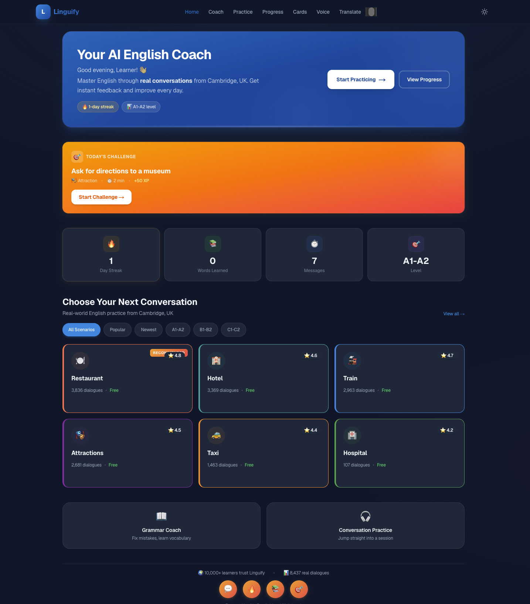
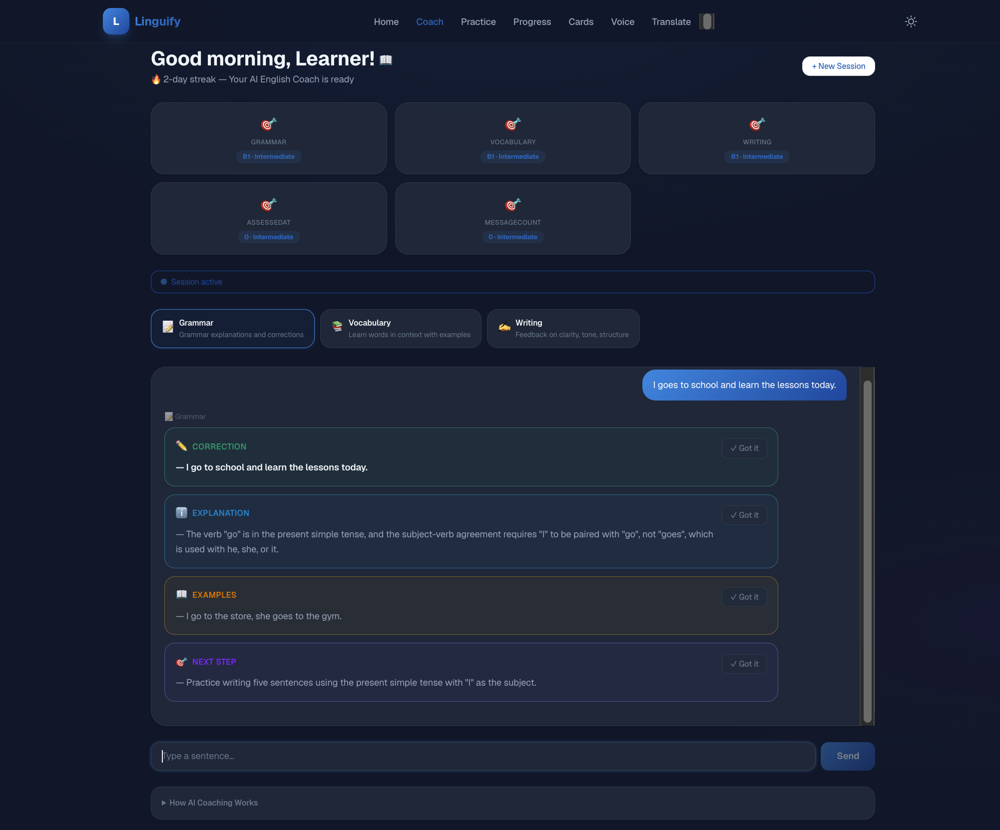
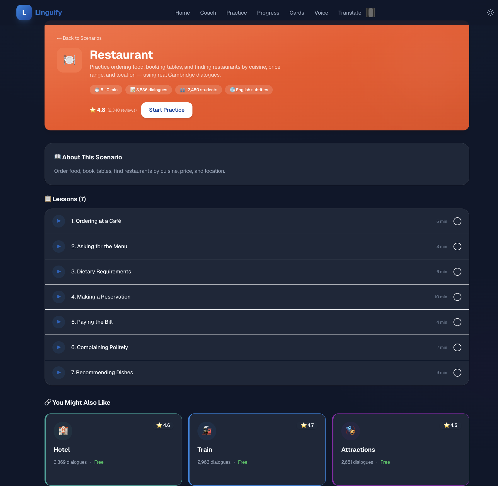
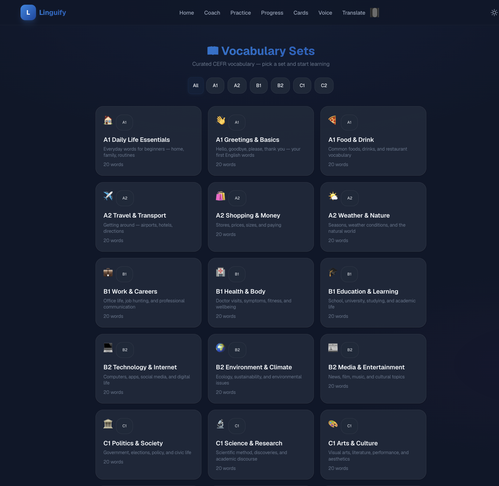
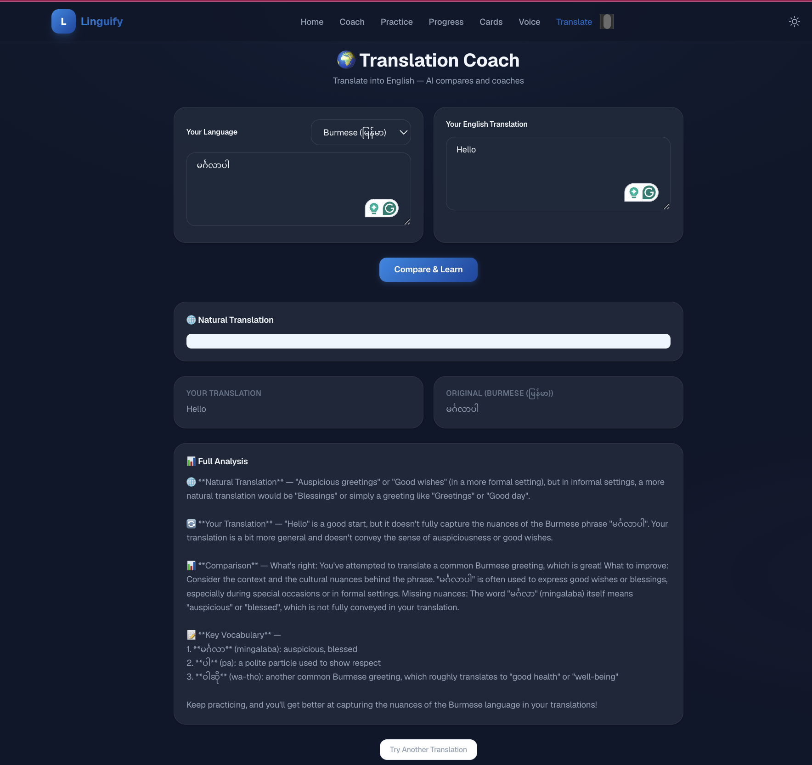
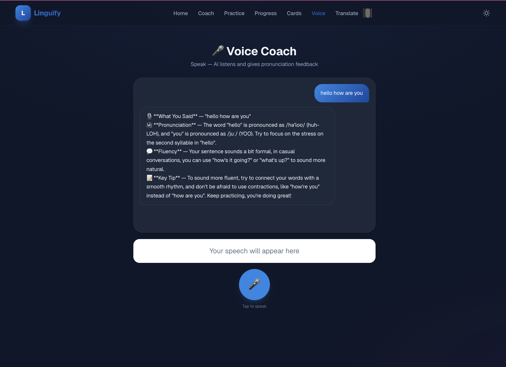

# Linguify

An AI-powered English language learning platform with real-world conversation practice, spaced-repetition flashcards, and CEFR-aligned vocabulary sets.

<h4> Built with Next.js 16, React 19, Tailwind CSS 4, and Groq (Llama 3.3 70B).</h4> 
<h4> </h4>Explore and test Linguify at https://linguify-eta.vercel.app</h4>


## Screenshots

| Home | AI Coach |
|:---:|:---:|
|  |  |

| Practice Coach | Flashcards |
|:---:|:---:|
|  |  |

| Translation | Voice Coach |
|:---:|:---:|
|  |  |

---

## Features

### AI English Coach
Three coaching modes — **Grammar**, **Vocabulary**, and **Writing** — with real-time streaming feedback. The AI analyzes your input and provides structured corrections, explanations, example sentences, and practice exercises. Coaching responses automatically generate flashcards for review.

### Conversation Practice
Real-world role-play scenarios powered by the **MultiWOZ 2.2** dataset — 8,437 authentic Cambridge, UK dialogues across 6 domains:
- 🍽️ Restaurant — order food, book tables
- 🏨 Hotel — book rooms, check amenities
- 🚂 Train — check schedules, find routes
- 🎭 Attractions — find museums, parks
- 🚕 Taxi — book rides, give directions
- 🏥 Hospital — describe symptoms, make appointments

Each domain has 5–7 lessons with scenario-based practice.

### Translation Coach
Write a sentence in your native language, translate it to English, and get AI feedback comparing your translation with natural English. Supports **18 native languages** including Burmese, Spanish, French, German, Japanese, Korean, Chinese, Arabic, and more.

### Voice Practice
Speak into your microphone and receive AI feedback on pronunciation, fluency, and key tips. Uses the Web Speech API with text-to-speech readback of feedback.

### Spaced Repetition Flashcards
A full **SM-2 spaced repetition** engine for efficient vocabulary retention:
- Flip-card UI with 4 quality ratings (Forgot / Hard / Good / Easy)
- Cards auto-generated from coaching sessions
- Manual card creation and bulk import
- Source filtering (Coaching, Manual, AI, Sets)

### CEFR Vocabulary Sets
**18 curated vocabulary sets** across all CEFR levels (A1–C2), 20 words each — 360 words total:

| Level | Sets |
|-------|------|
| A1 | Daily Life, Greetings, Food |
| A2 | Travel, Shopping, Weather |
| B1 | Work, Health, Education |
| B2 | Technology, Environment, Media |
| C1 | Politics, Science, Arts |
| C2 | Philosophy, Law, Idioms |

Each word includes definition, example sentence, part of speech, and IPA phonetic transcription. Browse sets, add them to your deck, and study with spaced repetition.

### AI Card Generation
Generate vocabulary flashcards on any topic at any CEFR level using AI. Also supports bulk import via CSV-like text format.

### Gamification
- **XP system** — earn points per flashcard review (10–15 XP, streak bonuses)
- **10 levels** — progress from Level 1 (0 XP) to Level 10 (12,000 XP)
- **8 achievements** — First Card, Century, Week Warrior, Sharpshooter, Set Scholar, and more
- **Streak tracking** — consecutive days of activity
- **Mastery indicators** — circular progress rings per vocabulary set

### Progress Dashboard
Track your learning journey with:
- Session and message counts
- Day streak
- CEFR level per mode (grammar / vocabulary / writing)
- Common mistakes analysis
- Per-topic mastery scores
- Writing statistics
- Vocabulary word cloud
- Recent activity log

---

## Tech Stack

| Layer | Technology |
|-------|-----------|
| Framework | Next.js 16 (App Router) |
| Language | TypeScript |
| UI | React 19, Tailwind CSS 4 |
| AI | Groq SDK (Llama 3.3 70B Versatile) |
| Dataset | MultiWOZ 2.2 (8,437 dialogues) |
| Fonts | Geist Sans + Geist Mono |
| MCP | Model Context Protocol SDK |

---

## Getting Started

### Prerequisites
- Node.js 18+
- A [Groq API key](https://console.groq.com/) (optional — the app works with simulated responses without one)

### Installation

```bash
git clone https://github.com/AyeNyeinSan22/linguify.git
cd linguify
npm install
```

### Environment

```bash
cp .env.example .env
# Add your Groq API key:
# GROQ_API_KEY=gsk_...
```

### Run

```bash
npm run dev       # Development server
npm run build     # Production build
npm run start     # Production server
npm run lint      # Linter
```

Open [http://localhost:3000](http://localhost:3000).

---

## Project Structure

```
linguify/
├── data/
│   ├── progress.json              # Server-side progress persistence
│   └── vocab-sets/                # 18 CEFR vocabulary sets (JSON)
│       ├── index.json             # Set manifest
│       ├── a1-daily-life.json     # 20 words per set
│       └── ...
├── mcp-servers/
│   ├── skill-server.js            # MCP: English coaching tools
│   └── agent-server.js            # MCP: Practice coaching tools
└── src/
    ├── app/
    │   ├── page.tsx               # Home — greeting, scenarios, quick actions
    │   ├── skill/page.tsx         # AI Coach — grammar/vocab/writing
    │   ├── agent/page.tsx         # Practice — MultiWOZ role-play
    │   ├── flashcards/
    │   │   ├── page.tsx           # Flashcard review hub
    │   │   ├── sets/page.tsx      # Vocabulary sets browser
    │   │   ├── sets/[setId]/      # Set detail + study
    │   │   └── my-cards/page.tsx  # Personal card management
    │   ├── translate/page.tsx     # Translation coach
    │   ├── voice/page.tsx         # Voice/speech coach
    │   ├── dashboard/page.tsx     # Progress dashboard
    │   ├── scenario/[domain]/     # Scenario detail + practice
    │   └── api/
    │       ├── coach/             # POST — AI coaching (SSE streaming)
    │       ├── practice/          # POST — Practice sessions
    │       ├── flashcards/        # POST — generate, review, AI, bulk import
    │       ├── vocab-sets/        # GET — browse vocabulary sets
    │       ├── progress/          # GET — user progress data
    │       ├── prompts/           # GET — daily writing prompts
    │       ├── scenarios/         # GET/POST — MultiWOZ scenarios
    │       └── translate/         # POST — translation coaching
    ├── components/
    │   ├── Navbar.tsx             # Navigation with flashcard badge
    │   ├── ChatPanel.tsx          # Reusable chat interface
    │   ├── GreetingBanner.tsx     # Hero with streak/level
    │   ├── DailyChallenge.tsx     # Rotating daily task
    │   ├── CourseCard.tsx         # Scenario card
    │   ├── OnboardingWizard.tsx   # First-time user modal
    │   ├── flashcards/
    │   │   ├── FlashcardViewer.tsx    # Flip-card with ratings
    │   │   ├── FlashcardStatsBar.tsx  # Stats display
    │   │   ├── XPNotification.tsx     # Animated XP popup
    │   │   ├── AchievementPopup.tsx   # Achievement unlock modal
    │   │   ├── MasteryIndicator.tsx   # Circular progress ring
    │   │   └── CardEditor.tsx         # Card create/edit form
    │   └── ...
    └── lib/
        ├── flashcard-engine.ts    # SM-2 algorithm + card generation
        ├── progress-store.ts      # XP, achievements, stats persistence
        ├── vocab-sets.ts          # CEFR vocabulary data queries
        ├── user-sets-store.ts     # User-created set persistence
        ├── multiwoz.ts            # MultiWOZ dataset utilities
        ├── session-store.ts       # In-memory session management
        ├── level-store.ts         # CEFR level tracking
        ├── prompts.ts             # Writing prompt bank (65 prompts)
        └── constants.ts           # Domain styles, gamification config
```

---

## API Routes

| Route | Method | Purpose |
|-------|--------|---------|
| `/api/coach` | POST | AI coaching (grammar/vocab/writing/voice), SSE streaming |
| `/api/practice` | POST | Practice sessions (roleplay/drill/conversation) |
| `/api/flashcards` | POST | `generate` · `review-stats` · `ai-generate` · `bulk-import` · `save-set` |
| `/api/vocab-sets` | GET | Browse sets, filter by level/topic, search |
| `/api/progress` | GET | XP, level, achievements, mastery, stats |
| `/api/prompts` | GET | Daily writing prompts by CEFR level |
| `/api/scenarios` | GET/POST | MultiWOZ domain data and scenario generation |
| `/api/translate` | POST | Translation coaching |

---

## Storage

**Client-side (localStorage):**
- `linguify-flashcards` — flashcard array with SM-2 state
- `linguify-onboarded` — first-time user flag
- `linguify-level` — selected level
- `linguify-theme` — dark/light preference
- `linguify-recent-sessions` — recent practice sessions

**Server-side (JSON files with in-memory fallback for Vercel):**
- `data/progress.json` — coaching history, XP, achievements, mastery
- `data/levels.json` — CEFR level per mode
- `data/user-sets.json` — user-created vocabulary sets

---

## License

MIT
